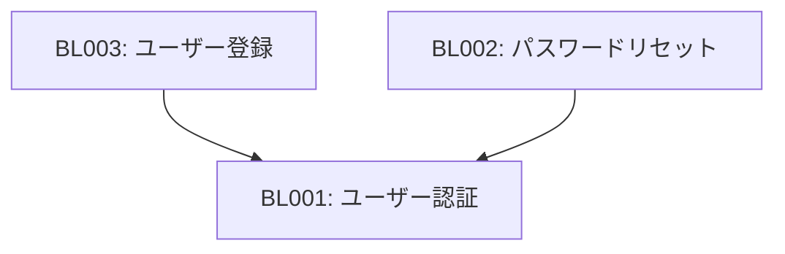

<!--
このドキュメントはビジネスロジック一覧のテンプレートです。

【使い方】
- システム全体のビジネスロジックを一覧管理してください
- ロジックID、名称、概要、入出力、処理フロー、例外処理を記載してください
- 詳細仕様は個別ファイルで管理し、リンクを設定してください
- ロジック間の依存関係をMermaid図で可視化してください
- カテゴリ別に分類して管理してください

【記載項目】
- ロジックID: BL001形式の一意識別子
- ロジック名: ビジネスロジックの名称
- 概要: ロジックの目的と機能の簡潔な説明
- 入力: 受け取るパラメータやデータ
- 出力: 返すデータや結果
- 処理フロー: 実行手順（番号付き）
- 例外処理: エラーケースとその対応
- 関連画面: 使用する画面ID
- 詳細仕様: 個別仕様書へのリンク
- 備考: 制約事項や注意点
-->

# ビジネスロジック一覧

本ドキュメントは、アプリケーションのビジネスロジックを一覧管理するためのテンプレートです。
各ビジネスロジックの概要と詳細仕様書へのリンクを提供し、システム全体のロジック構成を把握できます。

<!--
ビジネスロジック一覧表の使用方法

このテーブルはシステム全体のビジネスロジックを一覧管理するものです。
各ロジックの概要と詳細仕様書へのリンクを提供し、システム全体のロジック構成を把握できます。

## 記入項目の説明

- ロジックID：BL001形式の一意識別子（連番で管理）
- ロジック名：ビジネスロジックの名称
- 概要：ロジックの目的と機能の簡潔な説明
- 入力：受け取るパラメータやデータ
- 出力：返すデータや結果
- 処理フロー：実行手順（番号付きで記載）
- 例外処理：エラーケースとその対応
- 関連画面：使用する画面ID（画面一覧と整合性を保つ）
- 詳細仕様：個別仕様書へのリンク
- 備考：制約事項や注意点

## 記入時の注意点

- ロジックIDは重複しないよう連番で管理する
- 処理フローは具体的な手順を番号付きで記載する
- 例外処理は想定されるエラーケースを網羅的に記載する
- 関連画面IDは画面一覧と整合性を保つ
- 詳細仕様リンクは実在するファイルを参照する
- パフォーマンス要件がある場合は備考欄に記載する
-->
## ビジネスロジック一覧表

| ロジックID | ロジック名 | 概要 | 入力 | 出力 | 処理フロー | 例外処理 | 関連画面 | 詳細仕様 | 備考 |
|:----------|:----------|:-----|:-----|:-----|:----------|:---------|:---------|:---------|:-----|
| BL001 | ユーザー認証 | メールアドレスとパスワードによる認証処理 | メールアドレス、パスワード | 認証結果、ユーザー情報、認証トークン | 1.入力値検証 2.DB照合 3.パスワード照合 4.認証トークン生成 | 認証失敗時はエラーメッセージ表示、3回失敗でアカウントロック | SC001 | [ユーザー認証詳細](user_authentication.md) | セッション有効期限24時間 |
| BL002 | パスワードリセット | パスワード再設定のためのメール送信処理 | メールアドレス | 送信結果、リセットトークン | 1.メールアドレス検証 2.リセットトークン生成 3.メール送信 4.DB更新 | メールアドレス未登録時は成功レスポンス（セキュリティ考慮） | SC001 | [パスワードリセット詳細](password_reset.md) | トークン有効期限30分 |
| BL003 | ユーザー登録 | 新規ユーザーアカウント作成処理 | ユーザー情報（名前、メール、パスワード） | 登録結果、ユーザーID | 1.入力値検証 2.重複チェック 3.パスワードハッシュ化 4.DB登録 5.確認メール送信 | メールアドレス重複時はエラー、登録失敗時はロールバック | SC010 | [ユーザー登録詳細](user_registration.md) | メール認証必須 |

<!--
ロジック間の依存関係図の使用方法

このMermaid図はビジネスロジック間の依存関係を可視化するものです。
ロジックの実行順序や前提条件を理解するために使用します。

## 記載方法

- Mermaid記法のgraph TDを使用してフローチャートを作成
- ノードにはロジックIDとロジック名を記載
- 矢印で依存関係の方向を示す（A -> B は「AがBの前提条件」を意味）
- 複雑な依存関係がある場合は、サブグラフで分類することも可能

## 更新時の注意点

- 新しいロジックを追加した際は依存関係図も更新する
- 循環依存が発生しないよう注意する
- 依存関係が複雑になりすぎた場合は、ロジックの分割を検討する
-->
## ロジック間の依存関係

<!--
カテゴリ別分類の使用方法

ビジネスロジックを機能や役割に応じてカテゴリ別に分類します。
これにより、関連するロジックをグループ化して管理しやすくします。

## カテゴリの定義

- 認証系：ユーザー認証、登録、パスワード管理に関するロジック
- データ処理系：検索、フィルタリング、データ変換に関するロジック
- 業務処理系：ビジネス固有の処理、トランザクション処理に関するロジック
- 通知系：メール送信、プッシュ通知に関するロジック
- 外部連携系：外部API呼び出し、データ同期に関するロジック

## 管理方法

- 新しいロジックを追加した際は適切なカテゴリに分類する
- カテゴリが不明確な場合は新しいカテゴリを作成することも可能
- 各カテゴリ内ではロジックIDの昇順で並べる
-->
## カテゴリ別分類

### 認証系ロジック

- BL001: ユーザー認証
- BL002: パスワードリセット
- BL003: ユーザー登録

## 関連ドキュメント

- [画面一覧](../screen_list.md): 関連画面の詳細
- [外部インターフェース一覧](../external_interface/external_interface_list.md): 連携する外部API
- [機能仕様書一覧](../functional_specification_list.md): 関連する機能仕様
