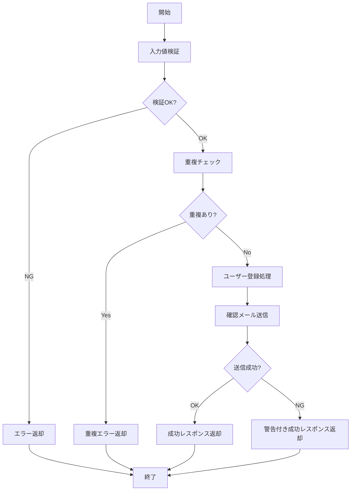

<!--
このドキュメントはビジネスロジックの個別詳細仕様書のテンプレートです。

【使い方】
- 各ビジネスロジックの詳細仕様を記載してください
- 入力パラメータ、出力データ、処理フロー、例外処理を詳細に記述してください
- セキュリティ要件、パフォーマンス要件、テスト観点も含めてください
- サンプルを参考に、必要な項目を入力してください
-->

# BL003: ユーザー登録 詳細仕様書

## 1. 概要

新規ユーザーアカウントの作成を行うビジネスロジックです。
メールアドレス、パスワード、基本情報を受け取り、重複チェック、パスワードハッシュ化、
メール認証機能を含む安全なユーザー登録システムを提供します。

<!--
入力パラメータの記載方法

ビジネスロジックが受け取る入力パラメータを定義します。
各パラメータの型、必須/任意、制約条件、説明を明確に記載してください。

## 記入項目の説明

- パラメータ名：APIやメソッドで使用するパラメータ名
- 型：データ型（string, number, boolean, object, array等）
- 必須：必須パラメータは○、任意は×
- 制約条件：文字数制限、形式、範囲等の制約
- 説明：パラメータの用途と内容

## 記入時の注意点

- パラメータ名は実装時の変数名と一致させる
- 制約条件は具体的に記載する（例：8文字以上、RFC準拠等）
- セキュリティに関わるパラメータは特に詳細に記載する
- 任意パラメータでもログ記録等で重要な場合は用途を明記する
-->
## 2. 入力パラメータ

| パラメータ名 | 型 | 必須 | 制約条件 | 説明 |
|:------------|:---|:-----|:---------|:-----|
| email | string | ○ | RFC 5322準拠のメール形式 | ユーザーのメールアドレス |
| password | string | ○ | 8文字以上、英数字記号含む | ユーザーのパスワード |
| confirmPassword | string | ○ | passwordと一致 | パスワード確認用 |
| name | string | ○ | 1-50文字、日本語・英数字 | ユーザーの表示名 |
| birthDate | string | × | YYYY-MM-DD形式 | 生年月日 |
| gender | string | × | male/female/other | 性別 |
| agreeToTerms | boolean | ○ | true | 利用規約への同意 |
| agreeToPrivacy | boolean | ○ | true | プライバシーポリシーへの同意 |
| deviceInfo | object | × | - | デバイス情報（ログ記録用） |
| ipAddress | string | × | IPv4/IPv6形式 | クライアントIPアドレス |
| language | string | × | ISO 639-1形式（ja, en等） | 確認メール送信言語（デフォルト：ja） |

### 入力例

```json
{
  "email": "newuser@example.com",
  "password": "SecurePass123!",
  "confirmPassword": "SecurePass123!",
  "name": "山田太郎",
  "birthDate": "1990-01-01",
  "gender": "male",
  "agreeToTerms": true,
  "agreeToPrivacy": true,
  "deviceInfo": {
    "userAgent": "Mozilla/5.0...",
    "platform": "iOS"
  },
  "ipAddress": "192.168.1.100",
  "language": "ja"
}
```

<!--
出力データの記載方法

ビジネスロジックが返すレスポンスデータを定義します。
成功時と失敗時で異なる構造になる場合は、それぞれ分けて記載してください。

## 記入項目の説明

- フィールド名：レスポンスに含まれるフィールド名
- 型：データ型（string, number, boolean, object, array等）
- 説明：フィールドの内容と用途

## 記入時の注意点

- 成功時と失敗時のレスポンス構造を明確に分ける
- セキュリティ情報（トークン等）は適切に説明する
- エラー時のフィールドはクライアント側の処理に必要な情報を含める
- 日時フィールドは形式（ISO 8601等）を明記する
- オブジェクト型の場合は内部構造も別途定義する
-->
## 3. 出力データ

### 成功時

| フィールド名 | 型 | 説明 |
|:------------|:---|:-----|
| success | boolean | 処理結果（true） |
| user | object | 作成されたユーザー情報 |
| message | string | 成功メッセージ |
| verificationRequired | boolean | メール認証が必要かどうか |
| verificationExpiresAt | datetime | 認証トークン有効期限（ISO 8601形式） |

### 失敗時

| フィールド名 | 型 | 説明 |
|:------------|:---|:-----|
| success | boolean | 処理結果（false） |
| errorCode | string | エラーコード |
| errorMessage | string | エラーメッセージ |
| validationErrors | array | 入力値検証エラーの詳細 |

### 出力例

```json
// 成功時
{
  "success": true,
  "user": {
    "id": "user456",
    "email": "newuser@example.com",
    "name": "山田太郎",
    "status": "pending_verification",
    "createdAt": "2024-12-31T12:00:00Z"
  },
  "message": "アカウントを作成しました。確認メールをお送りしましたので、メール認証を完了してください。",
  "verificationRequired": true,
  "verificationExpiresAt": "2024-12-31T12:30:00Z"
}

// 失敗時
{
  "success": false,
  "errorCode": "EMAIL_ALREADY_EXISTS",
  "errorMessage": "このメールアドレスは既に登録されています",
  "validationErrors": [
    {
      "field": "email",
      "message": "このメールアドレスは既に使用されています"
    }
  ]
}
```

<!--
処理フローの記載方法

ビジネスロジックの処理手順をMermaid図で可視化します。
複雑な分岐や例外処理も含めて、全体の流れを理解しやすく表現してください。

## 記載方法

- Mermaid記法のflowchartを使用してフローチャートを作成
- 処理ステップは四角形、判定は菱形で表現
- 分岐条件は矢印のラベルで明記
- エラー処理や例外ケースも含める
- 開始から終了まで全ての経路を網羅する

## 更新時の注意点

- 処理ステップの追加・変更時はフロー図も更新する
- 複雑になりすぎた場合はサブフローに分割することも検討
- 判定条件は具体的で分かりやすい表現にする
- セキュリティ関連の処理は特に詳細に記載する
-->
## 4. 処理フロー



<!--
詳細処理手順の記載方法

フローチャートで表現した処理を、より詳細なテキストで補足説明します。
各ステップで実行される具体的な処理内容を記載してください。

## 記載方法

- フローチャートの主要ステップごとに詳細を記載
- 処理内容は具体的で実装可能なレベルで記述
- セキュリティ要件や制約事項も含める
- 設定値（閾値、有効期限等）は具体的な数値で記載

## 記入時の注意点

- フローチャートとの整合性を保つ
- 実装時に参照できる詳細レベルで記載
- セキュリティに関わる処理は特に詳細に記述
- 設定値は運用要件に基づいて決定する
-->
### 詳細処理手順

1. **入力値検証**
   - 必須項目の存在チェック
   - データ形式・制約の確認
   - 同意確認フラグのチェック

2. **重複チェック**
   - メールアドレスの重複確認
   - ユーザー名の重複確認（必要に応じて）

3. **ユーザー登録処理**
   - パスワードのハッシュ化
   - ユーザーIDの生成
   - データベースへの登録
   - 認証トークンの生成

4. **確認メール送信**
   - 確認メールの作成
   - 外部メールサービス経由で送信
   - 登録履歴の記録

<!--
例外処理の記載方法

ビジネスロジックで発生する可能性のあるエラーケースを網羅的に定義します。
各エラーに対する適切な対応方法も含めて記載してください。

## 記入項目の説明

- エラーケース：エラーが発生する状況や条件
- エラーコード：システム内で使用する一意のエラー識別子
- エラーメッセージ：ユーザーに表示するメッセージ
- HTTPステータス：WebAPIの場合のHTTPステータスコード
- 対応：エラー発生時の推奨対応方法

## 記入時の注意点

- セキュリティを考慮してエラーメッセージは適切に設計する
- エラーコードは他のロジックと重複しないよう管理する
- HTTPステータスコードは標準に準拠する
- ユーザビリティを考慮した対応方法を記載する
- システムエラーと業務エラーを明確に分ける
-->
## 5. 例外処理

| エラーケース | エラーコード | エラーメッセージ | HTTPステータス | 対応 |
|:------------|:-------------|:----------------|:---------------|:-----|
| バリデーションエラー | VALIDATION_ERROR | 入力値が正しくありません | 400 | 入力値修正を促す |
| パスワード不一致 | PASSWORD_MISMATCH | パスワードが一致しません | 400 | パスワード再入力を促す |
| パスワード強度不足 | WEAK_PASSWORD | パスワードが安全ではありません | 400 | パスワード強化を促す |
| メールアドレス重複 | EMAIL_ALREADY_EXISTS | このメールアドレスは既に登録されています | 409 | 別のメールアドレス使用を促す |
| 同意未確認 | TERMS_NOT_AGREED | 利用規約への同意が必要です | 400 | 同意確認を促す |
| ユーザーID生成失敗 | USER_ID_GENERATION_FAILED | 一時的なエラーが発生しました | 500 | 時間をおいて再試行を促す |
| DB登録エラー | DATABASE_ERROR | 一時的なエラーが発生しました | 500 | 時間をおいて再試行を促す |
| メール送信失敗 | EMAIL_SEND_FAILED | 確認メール送信に失敗しました | 500 | 登録は完了、後でメール再送信 |
| トランザクションエラー | TRANSACTION_ERROR | 一時的なエラーが発生しました | 500 | 時間をおいて再試行を促す |
