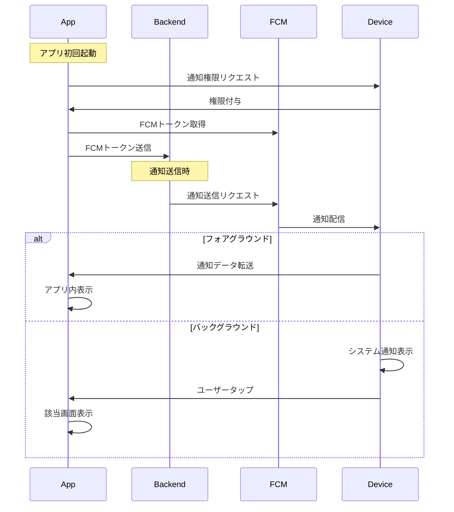

<!--
このドキュメントは外部連携仕様書のテンプレートです。
以下の構造に従って他の外部連携仕様書を作成してください：

1. ドキュメントタイトル
   - 連携名を含めた明確なタイトルを記載

2. 概要セクション
   - 連携の目的と主な機能を簡潔に説明
   - 対象となる外部システムの情報を含める

3. 認証/連携フロー
   - ユーザーまたはシステムの操作順序を番号付きリストで記載
   - 各ステップの詳細をサブリストとしてインデントして記載
   - 条件分岐がある場合は、その条件と処理を明確に記載

4. 技術仕様
   - クライアントサイド実装
     * 使用するSDKやライブラリ
     * 必要な権限や設定
   - サーバーサイド実装
     * 使用する認証方式やAPI
     * 必要な認証情報
   - セキュリティ要件
     * データの保存方法
     * セキュリティ対策

<!--
参考ドキュメントセクション
- 外部システムの公式ドキュメントへのリンク
- 特に重要な技術資料やガイドラインへのリンク
- バージョンや更新日に注意
-->

<!--
タイトルセクション
- 外部連携の種類を明確に示すタイトルを記載
-->

# Firebase Cloud Messaging仕様書テンプレート

<!--
概要セクション
- この外部連携が何を実現するのかを簡潔に説明
- 主要な機能や目的を明確に記述
- 対象となる外部システムの情報を含める
-->

## 概要

本ドキュメントではアプリケーションにおけるFirebase Cloud Messaging（FCM）を利用したプッシュ通知機能の実装仕様について記述します。

<!--
認証/連携フローセクション
- システムの操作手順を時系列で記載
- 各ステップは番号付きリストで記載
- 条件分岐や詳細説明はサブリストとしてインデント
-->

<!--
参考ドキュメントセクション
- 外部システムの公式ドキュメントへのリンク
- 特に重要な技術資料やガイドラインへのリンク
- バージョンや更新日に注意
-->
## 参考ドキュメント

- [Firebase Cloud Messaging]
- [FCM Flutter Integration]
- [FCM Admin SDK]
- [Flutter firebase_messaging package]

## 通知フロー

1. アプリ初回起動時、FCMトークンを取得
   - バックグラウンド通知の権限をユーザーに要求
   - FCMトークンをバックエンドサーバーに送信

2. プッシュ通知送信時
   - バックエンドサーバーがFCM APIを使用して通知を送信
   - FCMサーバーが対象デバイスに通知を配信

3. 通知受信時の処理
   - フォアグラウンド時
     - アプリ内で通知を表示
     - 必要に応じてアプリの状態を更新
   - バックグラウンド時
     - システム通知として表示
     - ユーザーのタップでアプリを起動
     - 通知データに基づいて適切な画面に遷移

### ワークフロー図

<!--
技術仕様セクション
- 実装に必要な技術的な詳細を記載
- クライアントサイド、サーバーサイド、セキュリティの3つのサブセクションに分けて記載
-->
## 技術仕様

### クライアントサイド実装

- 使用SDK: `firebase_messaging` (Flutter)
- 必要な権限:
  - iOS: `UserNotifications`
  - Android: `POST_NOTIFICATIONS` (Android 13+)
- 通知設定:
  - バッジ数の管理
  - 通知音のカスタマイズ
  - 通知アイコンの設定

### サーバーサイド実装

- Firebase Admin SDK
- 必要な認証情報:
  - プロジェクトID
  - サービスアカウントキー
- 通知タイプ:
  - データメッセージ
  - 通知メッセージ
  - ハイブリッドメッセージ

### セキュリティ要件

- FCMトークンの安全な管理
- サービスアカウントキーの保護
- 通知データの暗号化（機密情報を含む場合）

<!--
環境設定セクション
- 開発環境と本番環境それぞれの設定手順を記載
-->
## 環境設定

### 開発環境

- Firebase Consoleでのプロジェクト作成
- `google-services.json`/`GoogleService-Info.plist`の設定
- デバッグ用証明書の登録（Android）

### 本番環境

- 本番用Firebase プロジェクトの作成
- APNs証明書の設定（iOS）
- ProGuard設定の追加（Android）

<!-- Links -->

<!-- ドキュメント -->

[Firebase Cloud Messaging]: <https://firebase.google.com/docs/cloud-messaging>
[FCM Flutter Integration]: <https://firebase.google.com/docs/cloud-messaging/flutter/client>
[FCM Admin SDK]: <https://firebase.google.com/docs/cloud-messaging/server>
[Flutter firebase_messaging package]: <https://pub.dev/packages/firebase_messaging>
