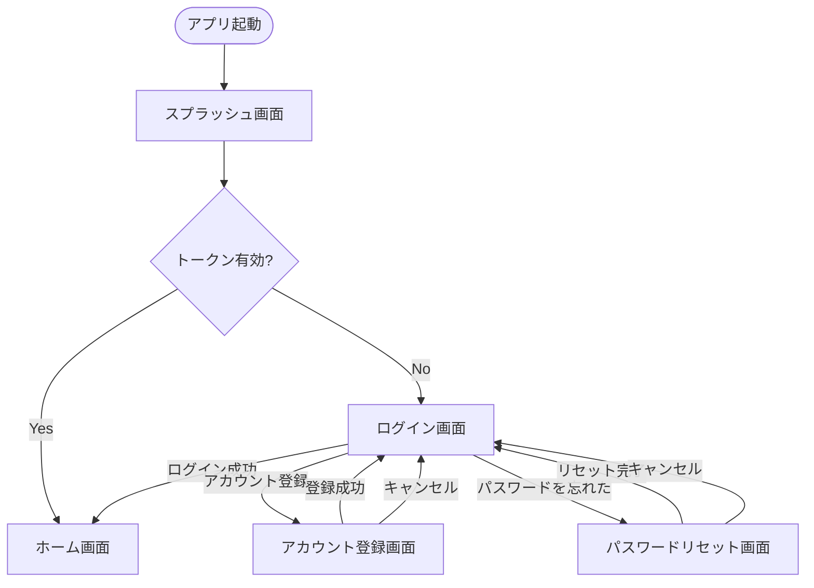
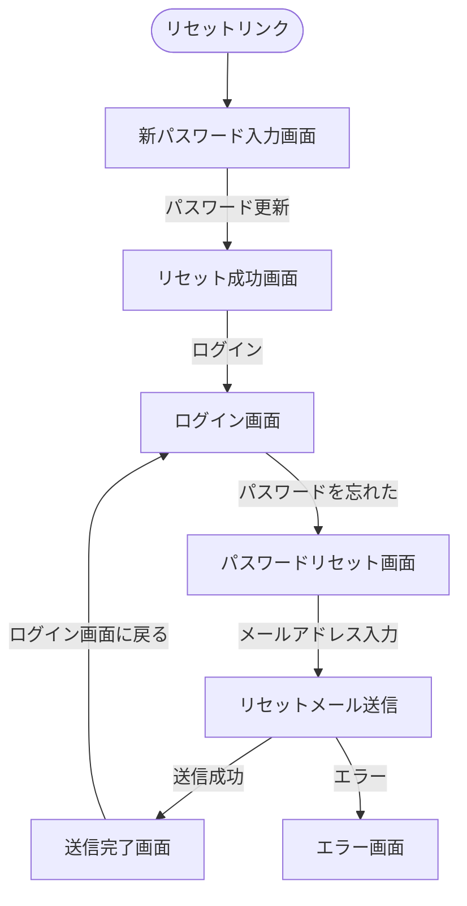
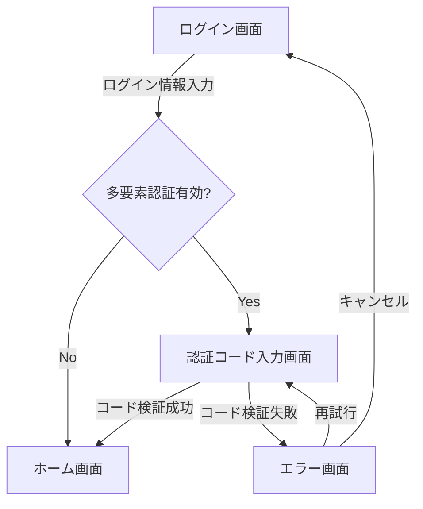
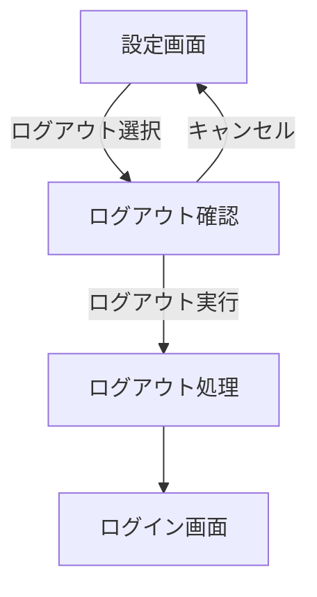

# 認証フロー画面遷移図

## 概要

<!--
このドキュメントでは、アプリケーションの認証に関連する画面遷移を詳細に記載します。
ユーザー認証、アカウント登録、パスワードリセットなどの認証関連機能の画面遷移フローを定義します。
メインの[画面遷移図](./screen_flow.md)の一部として参照されます。
-->

このドキュメントでは、アプリケーションの認証機能に関連する画面遷移を定義します。
ログイン、登録、パスワードリセットなどの認証関連機能を網羅し、ユーザー認証状態による条件分岐も記載しています。

## 認証フロー詳細

### 初期認証フロー

### パスワードリセットフロー

### 多要素認証フロー

### ログアウトフロー

## 備考

- セッションタイムアウト（30分）後は自動的にログアウトし、ログイン画面に遷移します
- 認証エラー時は共通のエラーダイアログで表示し、再試行または中断を選択できます
- ネットワーク接続がない場合は、オフライン警告を表示し、再接続後に自動リトライします
- パスワードリセットリンクの有効期限は24時間です
