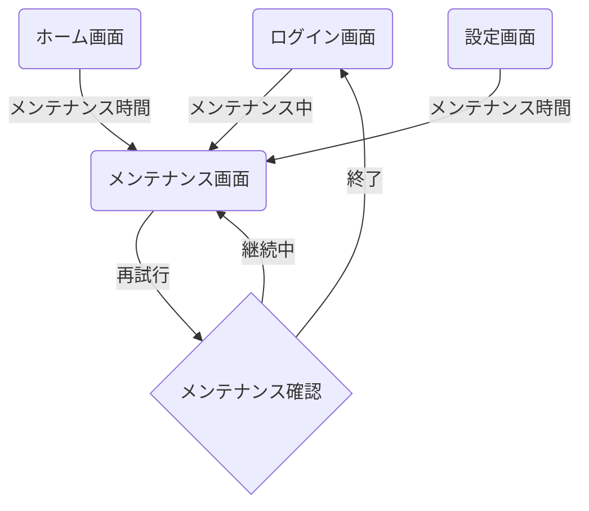
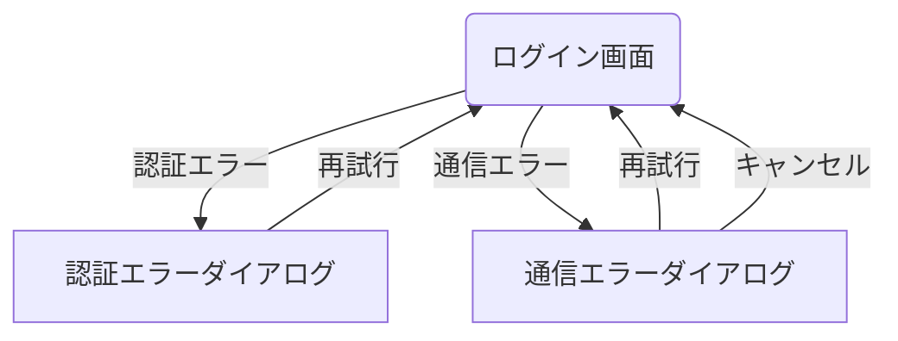

<!--
このドキュメントは機能別画面遷移図のテンプレートです。

【使い方】
- このテンプレートを基に、特定機能（ここでは認証機能）の画面遷移図を作成してください。
- 機能に関連する全ての画面とその遷移関係、条件を明確に記載してください。
- 必要に応じて図表や説明を追加し、開発者・デザイナー間での認識を統一してください。
- Mermaid記法を使用した図表の作成を推奨します。
- 機能内のサブカテゴリ（例：初期認証フロー、エラーハンドリングなど）ごとに整理してください。
- 同じ画面への遷移でも条件が異なる場合は、それぞれ別々に記載してください。
- 重複や表記揺れがないように注意してください。
- 画面名・遷移条件の記述は簡潔かつ明確にしてください。
- 画面名や用語は「用語集ドキュメント」、画面IDや詳細情報は「画面一覧表ドキュメント」を参照し、整合性を保ってください。
- メイン画面遷移図との整合性も確認してください。

【構成要素】
- 機能概要：この機能の目的と主な画面構成
- 詳細フロー：サブカテゴリごとの画面遷移図
- 備考：この機能特有の注意点や補足情報

【表記ルール】
- 画面IDはSCから始まる連番（例：SC001、SC002）で統一し、メイン画面遷移図と整合させてください
- 画面名は日本語（例：ログイン画面）を基本としてください
- 遷移条件は「"条件"」のように引用符で囲んで記載してください
- サブグラフを使用する場合は関連する画面でグループ化してください
- 全てのIDと名称は「画面一覧表ドキュメント」に準拠してください
- 用語の表記は「用語集ドキュメント」に準拠し、表記揺れを防止してください
-->

# 認証フロー画面遷移図

## 概要

<!--
このドキュメントでは、アプリケーションの認証に関連する画面遷移を詳細に記載します。
ユーザー認証、アカウント登録、パスワードリセットなどの認証関連機能の画面遷移フローを定義します。
メインの[画面遷移図](./screen_flow.md)の一部として参照されます。
-->

このドキュメントでは、アプリケーションの認証機能に関連する画面遷移を定義します。
ログイン、メンテナンス画面などの認証関連機能を網羅し、ユーザー認証状態による条件分岐も記載しています。

## 認証フロー詳細

<!--
認証フロー詳細セクションでは、認証機能全体を複数のサブフローに分けて詳細に記載します。
- 初期認証フロー、メンテナンス画面フロー、エラーハンドリングなど、関連するフローを整理して記載してください
- 各フローは独立したMermaidチャートで表現し、関連性がある場合は説明文で補足してください
- 画面IDと画面名を一貫して使用し、遷移条件を明確に記載してください
- 複雑な条件分岐がある場合は、図中に判断ロジックを含めてください
- 認証に関わる全ての画面と遷移を漏れなく記載してください
-->

### 初期認証フロー

<!--
初期認証フローでは、アプリ起動時からユーザーがログインするまでの基本フローを記載します。
- アプリ起動から認証画面表示までの流れを記載してください
- ログイン成功/失敗時の遷移先を明確にしてください
- 自動ログイン（トークン保存済み）の場合の分岐も記載してください
- メンテナンスモードなど、特殊な状態への分岐も記載してください
-->

### メンテナンス画面フロー

<!--
メンテナンス画面フローでは、システムメンテナンス時の画面遷移を記載します。
- メンテナンス画面への遷移条件（各画面からの遷移）を記載してください
- メンテナンス終了時の遷移先を明確にしてください
- メンテナンス中の再試行や確認フローも記載してください
- メンテナンス情報の表示方法や、ユーザーが取れるアクションを記載してください
-->

### エラーハンドリング

<!--
エラーハンドリングセクションでは、認証プロセス中に発生する各種エラーの処理フローを記載します。
- 認証エラー（パスワード不一致、アカウント存在しないなど）の処理を記載してください
- 通信エラー、サーバーエラーなどの技術的エラーの処理を記載してください
- 各エラーからの回復パスとユーザーへの通知方法を記載してください
- リトライ制限やアカウントロックなどの安全対策も記載してください
-->

## 備考

<!--
備考セクションでは、認証フローに関する補足情報や注意点を記載します。
- 認証に関する特殊な動作や制約事項を記載してください
- セキュリティに関する考慮事項（試行回数制限、セッションタイムアウトなど）も記載してください
- バックエンドAPIとの連携ポイントや依存関係も記載してください
- デバッグモードやテスト環境での特殊な動作があれば記載してください
- 将来的な拡張予定（SNS認証追加など）も記載してください
-->

- ログイン試行は連続5回失敗するとアカウントがロックされます
- メンテナンス画面では予定終了時刻を表示します
- アプリ起動時、バックエンドAPIの状態によって適切な画面を表示します
- 認証エラーはエラーコードごとに適切なメッセージを表示します
