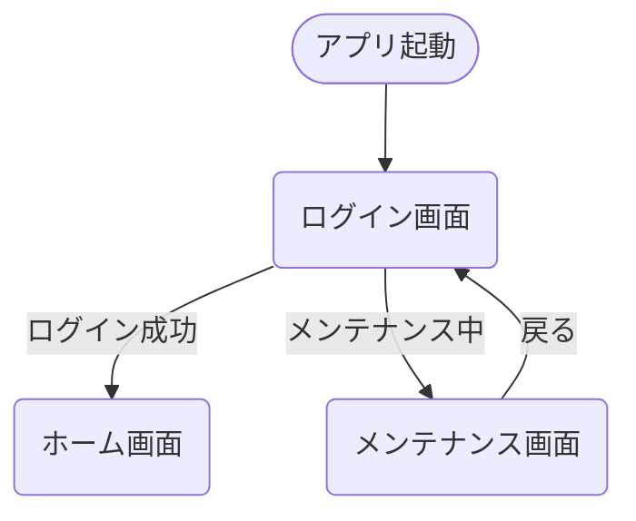
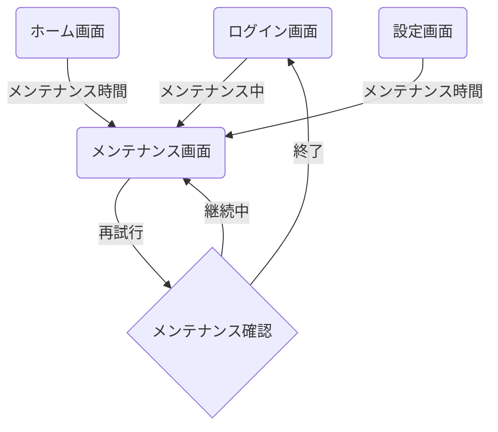
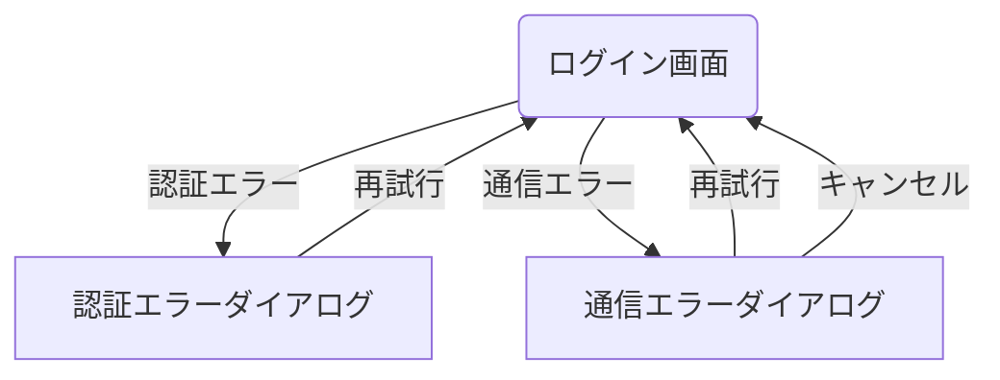

# 認証フロー画面遷移図

## 概要

<!--
このドキュメントでは、アプリケーションの認証に関連する画面遷移を詳細に記載します。
ユーザー認証、アカウント登録、パスワードリセットなどの認証関連機能の画面遷移フローを定義します。
メインの[画面遷移図](./screen_flow.md)の一部として参照されます。
-->

このドキュメントでは、アプリケーションの認証機能に関連する画面遷移を定義します。
ログイン、メンテナンス画面などの認証関連機能を網羅し、ユーザー認証状態による条件分岐も記載しています。

## 認証フロー詳細

### 初期認証フロー

### メンテナンス画面フロー

### エラーハンドリング

## 備考

- ログイン試行は連続5回失敗するとアカウントがロックされます
- メンテナンス画面では予定終了時刻を表示します
- アプリ起動時、バックエンドAPIの状態によって適切な画面を表示します
- 認証エラーはエラーコードごとに適切なメッセージを表示します
