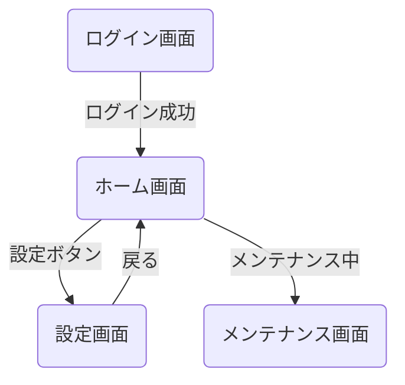
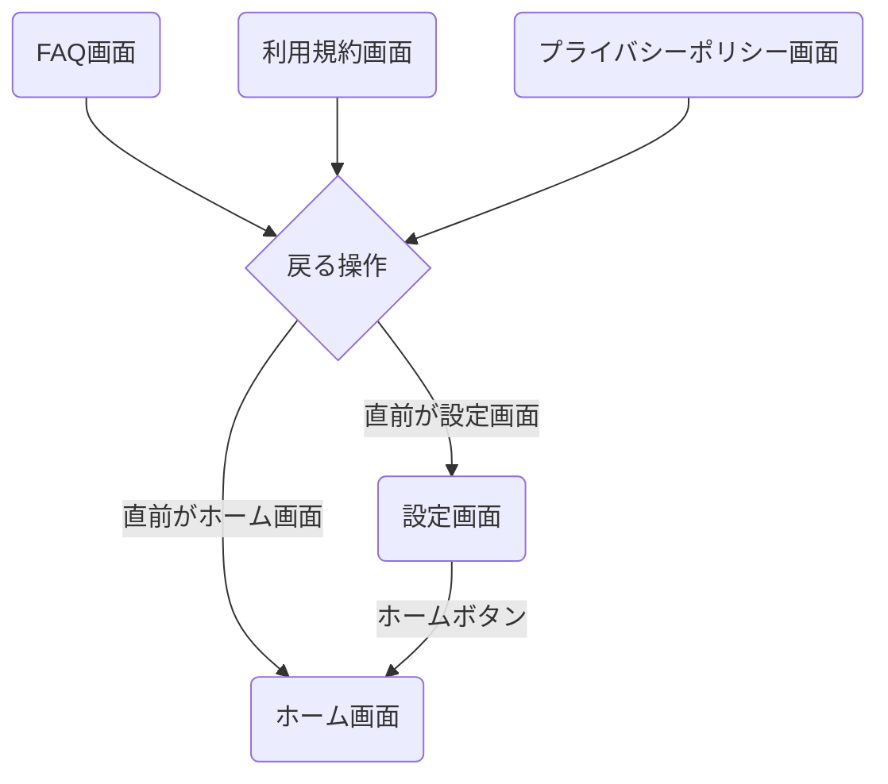
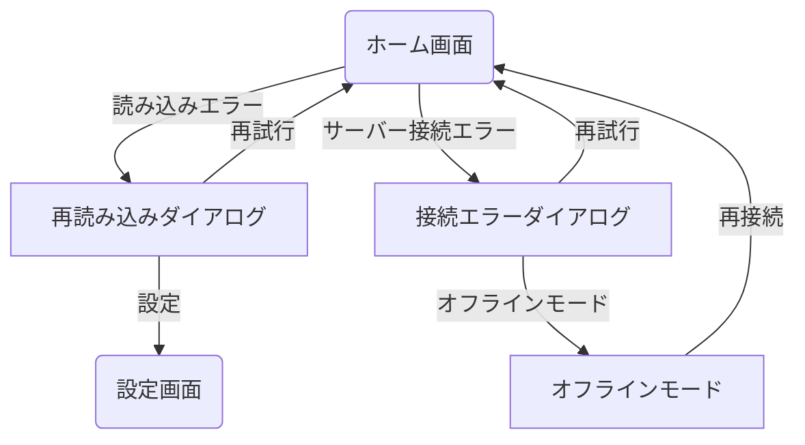

# ホーム機能フロー画面遷移図

## 概要

<!--
このドキュメントでは、アプリケーションのホーム画面を起点とした主要機能への画面遷移を詳細に記載します。
ホーム画面からアクセスできる機能や、関連する画面遷移のフローを定義します。
メインの[画面遷移図](./screen_flow.md)の一部として参照されます。
-->

このドキュメントでは、アプリケーションのホーム画面からの主要な機能への画面遷移を定義します。
ホーム画面からの設定画面への遷移など、ユーザーの主な利用シナリオに沿った画面遷移を記載しています。

## ホーム機能フロー詳細

### メインフロー

### 複数画面からのホーム画面への遷移

### エラー処理フロー

## 備考

- ホーム画面はアプリの起点となる重要な画面です
- 設定画面への遷移はスライドインアニメーションを使用します
- ホーム画面は常にナビゲーションスタックの最下層に位置します
- バックボタン/スワイプでホーム画面に戻ると、スクロール位置はリセットされます
