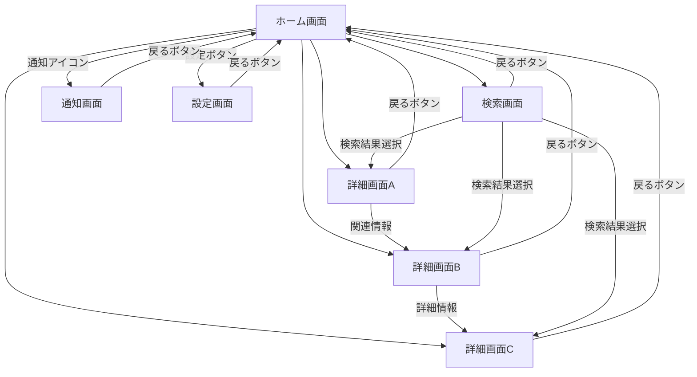
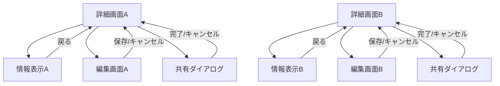
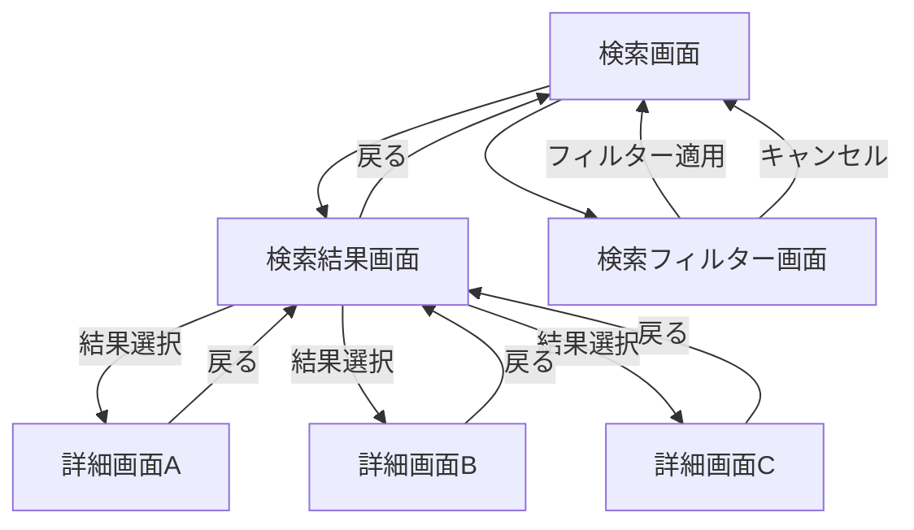
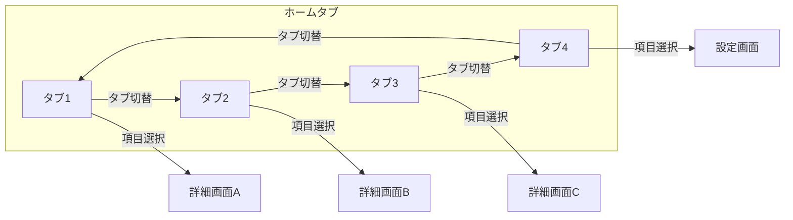

# ホーム機能フロー画面遷移図

## 概要

<!--
このドキュメントでは、アプリケーションのホーム画面を起点とした主要機能への画面遷移を詳細に記載します。
ホーム画面からアクセスできる機能や、関連する画面遷移のフローを定義します。
メインの[画面遷移図](./screen_flow.md)の一部として参照されます。
-->

このドキュメントでは、アプリケーションのホーム画面からの主要な機能への画面遷移を定義します。
ユーザーの主な利用シナリオに沿った画面遷移を記載し、ホーム画面を中心とした機能の流れを示しています。

## ホーム機能フロー詳細

### メインフロー

### 詳細画面フロー

### 検索フロー

### タブ切り替えフロー

## 備考

- 詳細画面からの「戻る」操作は、直前の画面に戻ります（ホーム画面または検索結果画面など）
- 各詳細画面ではスワイプによるページ切り替えも可能です
- タブ状態はアプリ再起動時も保持されます
- 編集画面では未保存の変更がある場合、「戻る」操作時に確認ダイアログを表示します
