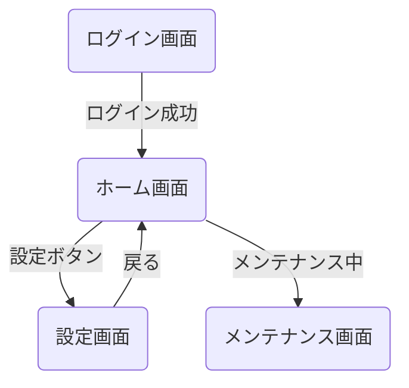
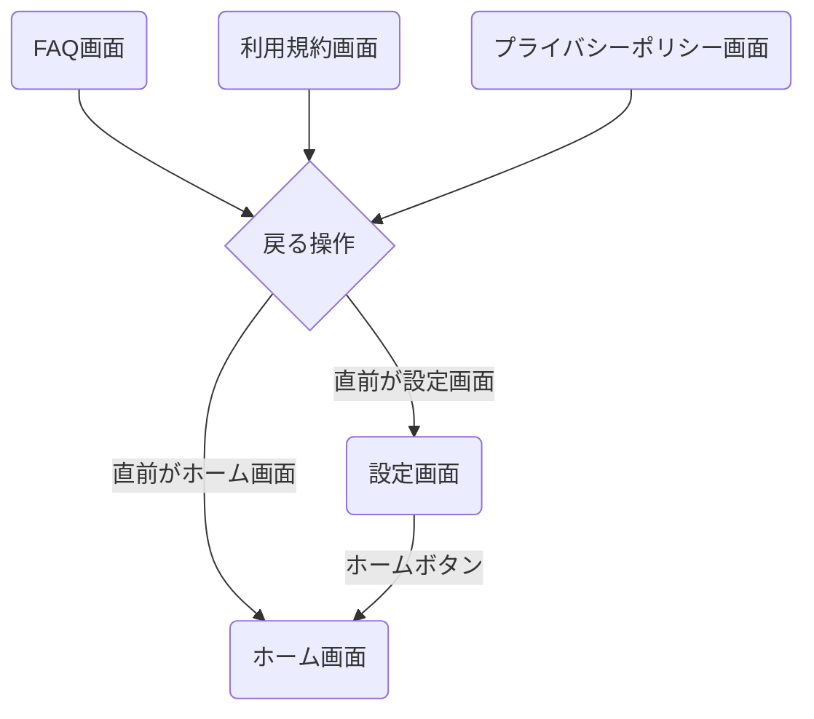
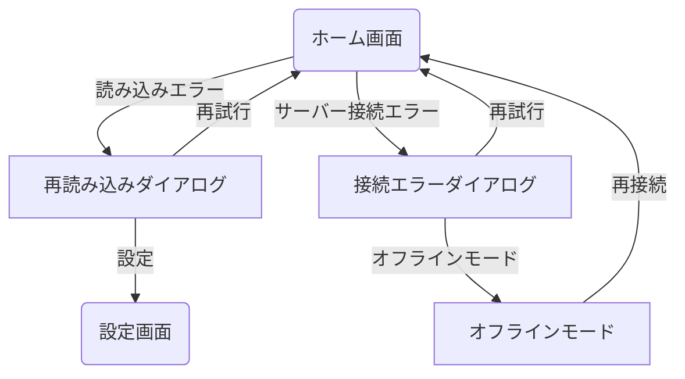

<!--
このドキュメントは機能別画面遷移図のテンプレートです。

【使い方】
- このテンプレートを基に、特定機能（ここではホーム機能）の画面遷移図を作成してください。
- 機能に関連する全ての画面とその遷移関係、条件を明確に記載してください。
- 必要に応じて図表や説明を追加し、開発者・デザイナー間での認識を統一してください。
- Mermaid記法を使用した図表の作成を推奨します。
- 機能内のサブカテゴリ（例：メインフロー、エラー処理フローなど）ごとに整理してください。
- 同じ画面への遷移でも条件が異なる場合は、それぞれ別々に記載してください。
- 重複や表記揺れがないように注意してください。
- 画面名・遷移条件の記述は簡潔かつ明確にしてください。
- 画面名や用語は「用語集ドキュメント」、画面IDや詳細情報は「画面一覧表ドキュメント」を参照し、整合性を保ってください。
- メイン画面遷移図との整合性も確認してください。

【構成要素】
- 機能概要：この機能の目的と主な画面構成
- 詳細フロー：サブカテゴリごとの画面遷移図
- 備考：この機能特有の注意点や補足情報

【表記ルール】
- 画面IDはSCから始まる連番（例：SC001、SC002）で統一し、メイン画面遷移図と整合させてください
- 画面名は日本語（例：ホーム画面）を基本としてください
- 遷移条件は「"条件"」のように引用符で囲んで記載してください
- サブグラフを使用する場合は関連する画面でグループ化してください
- 全てのIDと名称は「画面一覧表ドキュメント」に準拠してください
- 用語の表記は「用語集ドキュメント」に準拠し、表記揺れを防止してください
-->

# ホーム機能フロー画面遷移図

## 概要

<!--
このドキュメントでは、アプリケーションのホーム画面を起点とした主要機能への画面遷移を詳細に記載します。
ホーム画面からアクセスできる機能や、関連する画面遷移のフローを定義します。
メインの[画面遷移図](./screen_flow.md)の一部として参照されます。
-->

このドキュメントでは、アプリケーションのホーム画面からの主要な機能への画面遷移を定義します。
ホーム画面からの設定画面への遷移など、ユーザーの主な利用シナリオに沿った画面遷移を記載しています。

## ホーム機能フロー詳細

<!--
ホーム機能フロー詳細セクションでは、ホーム画面を中心とした機能全体を複数のサブフローに分けて詳細に記載します。
- メインフロー、複数画面からのホーム画面への遷移、エラー処理フローなど、関連するフローを整理して記載してください
- 各フローは独立したMermaidチャートで表現し、関連性がある場合は説明文で補足してください
- 画面IDと画面名を一貫して使用し、遷移条件を明確に記載してください
- 複雑な条件分岐がある場合は、図中に判断ロジックを含めてください
- ホーム機能に関わる全ての画面と遷移を漏れなく記載してください
-->

### メインフロー

<!--
メインフローでは、ホーム画面を中心とした基本的な画面遷移を記載します。
- ホーム画面からアクセス可能な主要な機能画面への遷移を記載してください
- ログイン画面からホーム画面への遷移など、他の機能からホーム画面への基本的な遷移も記載してください
- メンテナンスなどの特殊状態への遷移も記載してください
- ホーム画面内の主要な操作（タブ切り替えなど）がある場合は記載してください
-->

### 複数画面からのホーム画面への遷移

<!--
複数画面からのホーム画面への遷移セクションでは、様々な画面からホーム画面に戻るパターンを記載します。
- 「戻る」操作でホーム画面に遷移する条件と遷移先を明確にしてください
- ホームボタンなど、専用UIからの遷移も記載してください
- 画面履歴に応じた条件分岐がある場合は図解してください
- 画面間のナビゲーション階層を理解できるよう記載してください
-->

### エラー処理フロー

<!--
エラー処理フローセクションでは、ホーム画面周辺で発生する各種エラーの処理フローを記載します。
- 読み込みエラー、通信エラーなどの処理を記載してください
- 各エラーからの回復パスとユーザーへの通知方法を記載してください
- オフラインモードなど、エラー発生時の代替フローも記載してください
- ユーザーが取れるアクションとその結果を明確にしてください
-->

## 備考

<!--
備考セクションでは、ホーム機能に関する補足情報や注意点を記載します。
- ホーム画面に関する特殊な動作や制約事項を記載してください
- アニメーションやトランジションに関する詳細を記載してください
- ナビゲーションスタックの扱いやスクロール位置の保持など、UIの挙動に関する詳細も記載してください
- バックエンドAPIとの連携ポイントや依存関係も記載してください
- パフォーマンス最適化のための特別な考慮事項があれば記載してください
-->

- ホーム画面はアプリの起点となる重要な画面です
- 設定画面への遷移はスライドインアニメーションを使用します
- ホーム画面は常にナビゲーションスタックの最下層に位置します
- バックボタン/スワイプでホーム画面に戻ると、スクロール位置はリセットされます
