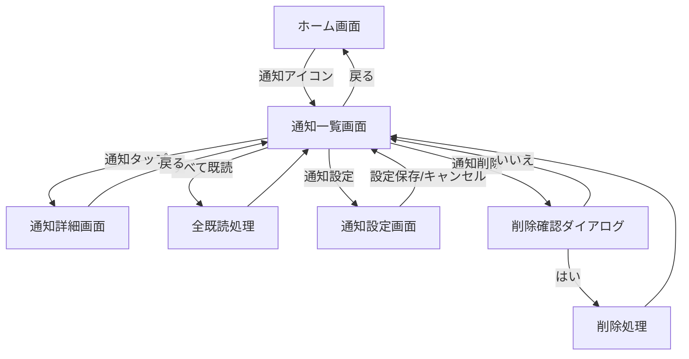
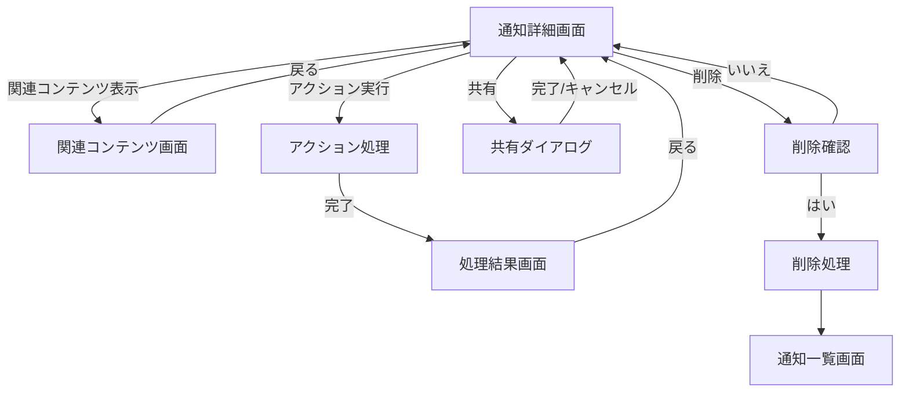
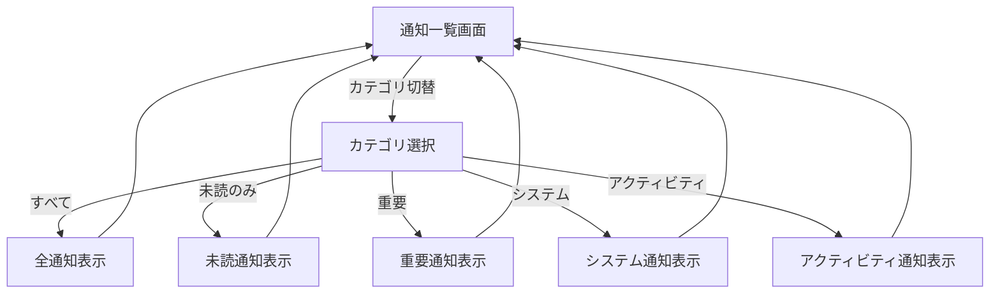
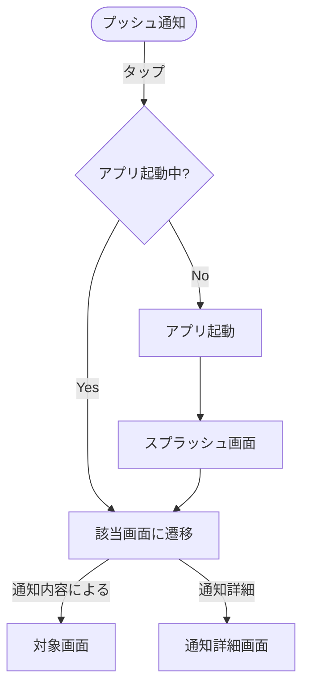

# 通知機能フロー画面遷移図

## 概要

<!--
このドキュメントでは、アプリケーションの通知機能に関連する画面遷移を詳細に記載します。
通知画面への遷移、通知からの画面遷移、通知管理などの画面遷移フローを定義します。
メインの[画面遷移図](./screen_flow.md)の一部として参照されます。
-->

このドキュメントでは、アプリケーションの通知機能に関連する画面遷移を定義します。
通知の表示、通知からのアクション、通知管理などの流れを記載しています。

## 通知機能フロー詳細

### 通知画面メインフロー

### 通知詳細フロー

### 通知カテゴリフロー

### プッシュ通知フロー

## 備考

- プッシュ通知からの起動時は、通知内容に関連する画面に直接遷移します
- 通知の削除は個別または一括で行うことができます
- システム通知は削除できないものもあります
- アプリがバックグラウンドとフォアグラウンドで通知表示方法が異なります
- 通知履歴は最大100件まで保存され、それ以上は古いものから自動削除されます
