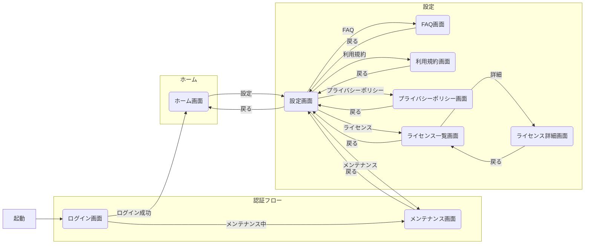
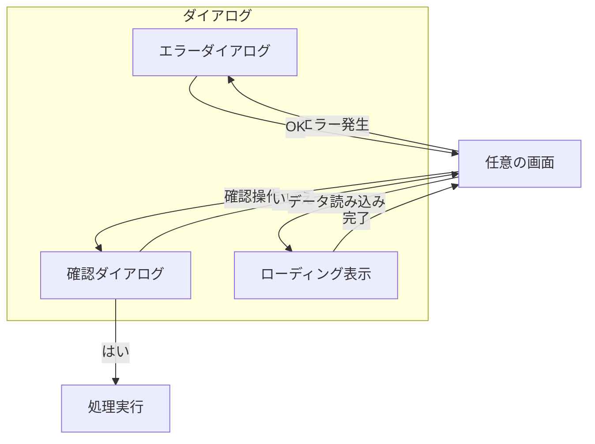
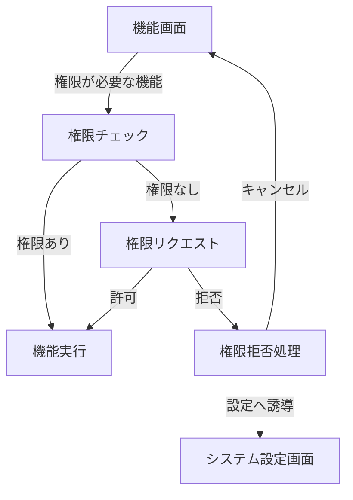
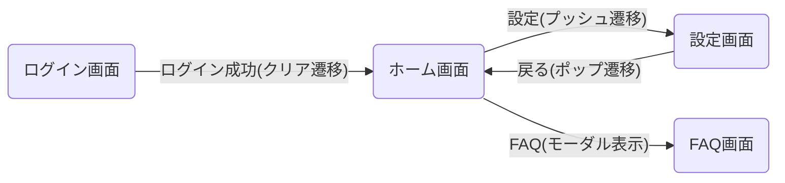
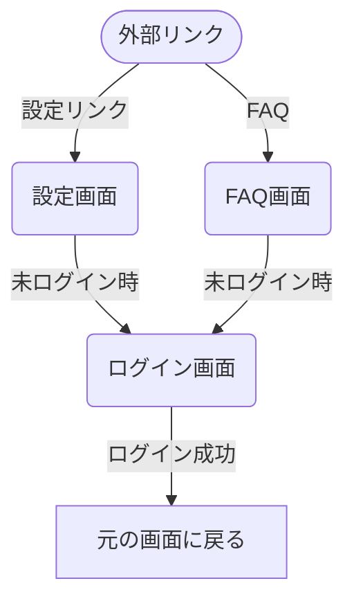

<!--
このドキュメントは画面遷移図のテンプレートです。

【使い方】
- このテンプレートを基に、アプリケーションの画面遷移図を作成してください。
- 画面ごとの遷移関係と条件を明確に記載してください。
- 必要に応じて図表や説明を追加し、開発者・デザイナー間での認識を統一してください。
- Mermaid記法を使用した図表の作成を推奨します。
- 機能カテゴリ（例：認証、ホーム、設定、通知など）ごとにフローを整理してください。
- 同じ画面への遷移でも条件が異なる場合は、それぞれ別々に記載してください。
- 重複や表記揺れがないように注意してください。
- 画面名・遷移条件の記述は簡潔かつ明確にしてください。
- サンプルを参考に、必要なフローを追加・修正してください。
- 画面名や用語は「用語集ドキュメント」、画面IDや詳細情報は「画面一覧表ドキュメント」を参照し、整合性を保ってください。

【大規模プロジェクト向け構成】
- 機能別の画面遷移図は別ファイルに分割することも可能です。
- screen_flow/ ディレクトリ内に機能別のmdファイルを作成してください。
  - 例: screen_flow/authentication_flow.md, screen_flow/settings.md など
- 各ファイルは本ファイルに記載のルールに従って作成してください。
- メインファイル（screen_flow.md）には全体概要と主要な遷移図、および各機能別ファイルへのリンクを記載してください。
- 機能別ファイルを更新した場合は、関連する他のファイルとの整合性を確認してください。

【構成要素】
- 画面ID：画面を一意に識別するためのID（例：SC001、SC002）
- 画面名：画面の日本語名（例：ログイン画面、ホーム画面）
- 画面名(英語)：コード内での命名に使用する英語名（例：LoginPage、HomePage）
- 画面グループ：機能や目的による画面の分類（例：認証、ホーム、設定）
- 遷移先(遷移種別)：画面間の遷移関係と遷移の種類
- 概要：画面の主な目的や機能
- 備考：補足情報や注意点

【表記ルール】
- 画面IDはSCから始まる連番（例：SC001、SC002）で統一してください
- 画面名は日本語（例：ログイン画面）を基本としてください
- 画面名(英語)は英語のPascalCaseで「Page」を付与（例：LoginPage）してください
- 遷移条件は「"条件"」のように引用符で囲んで記載してください
- サブグラフを使用する場合は機能カテゴリごとにグループ化してください
- 全てのIDと名称は「画面一覧表ドキュメント」に準拠してください
- 用語の表記は「用語集ドキュメント」に準拠し、表記揺れを防止してください

【Mermaid記法参考】
- Mermaidの基本的な書き方については、[Mermaidの公式ドキュメント](https://mermaid-js.github.io/mermaid/#/flowchart)を参照してください
-->

# 画面遷移図

## 概要

<!--
この概要セクションでは、このドキュメントの目的や使い方について簡潔に説明してください。
- 画面遷移図の目的（開発者間の認識統一、設計の全体像把握など）
- 想定される利用者（開発者、デザイナー、プロダクトオーナーなど）
- ドキュメントの更新タイミングや変更履歴の記録方法について言及してもよいでしょう
- 関連ドキュメント（用語集、画面一覧表など）との関係性についても触れるとよいでしょう
- 大規模プロジェクトの場合、ファイル分割方法と参照関係についても説明するとよいでしょう
-->

この画面遷移図は、アプリケーションの各画面間の遷移関係を示すものです。開発者・デザイナー・プロダクトオーナー間の共通理解を促進し、アプリケーションの全体像を把握するために活用してください。本ドキュメントは「用語集ドキュメント」と「画面一覧表ドキュメント」と併せて参照することで、より正確な実装の指針となります。

大規模プロジェクトでは、機能別に画面遷移図を分割して管理しています。このドキュメントはプロジェクト全体の概要と主要な画面遷移を示し、詳細な機能別フローは以下の専用ファイルで管理しています：

- [認証フロー](./authentication_flow.md)
- [ホーム機能フロー](./home_flow.md)
- [設定機能フロー](./settings.md)

これらのファイルを更新する際は、他のファイルとの整合性を確認し、必要に応じて関連ファイルも更新してください。

## 画面遷移図（全体）

<!--
全体の画面遷移図では、アプリケーション全体の画面遷移を俯瞰できるように記載してください。
- 全ての画面を含める必要はありませんが、主要な画面と遷移は必ず含めてください
- 可読性を高めるため、関連する画面はサブグラフでグループ化することを推奨します
- 遷移条件が複雑な場合は、詳細は機能別ファイルに記載し、ここではシンプルにまとめてください
- 矢印のスタイル（実線/点線）や色を使い分けることで、遷移の種類や重要度を表現することもできます
- 詳細は各機能別ファイルを参照するよう促してください
-->

※ 詳細な画面遷移は各機能別ファイルを参照してください。ここでは全体の大まかな流れのみを記載しています。

## 機能別画面遷移図

<!--
このセクションでは、機能カテゴリごとの画面遷移図の概要と各ファイルへのリンクを記載します。
- 各機能カテゴリの概要説明と、詳細ファイルへのリンクを提供してください
- 機能分割の基準や考え方について簡単に説明するとよいでしょう
- 機能間の関連性や依存関係がある場合は、それについても言及するとよいでしょう
- 表形式で整理すると視覚的に理解しやすくなります
-->

アプリの機能は以下のカテゴリに分けて管理しています。各カテゴリの詳細な画面遷移は、リンク先のファイルを参照してください。

| 機能カテゴリ | 概要 | 備考 |
|------------|------|------|
| [認証フロー](./authentication_flow.md) | ログイン、認証に関連する画面と遷移を含みます | ログイン画面、メンテナンス画面を含む |
| [ホーム機能フロー](./home_flow.md) | ホーム画面を起点とした主要機能への遷移を含みます | ホーム画面からの各種遷移を含む |
| [設定機能フロー](./settings.md) | 設定画面と関連する設定項目画面の遷移を含みます | FAQ、利用規約、プライバシーポリシー、ライセンス画面を含む |

## 共通UI要素とシステムフロー

<!--
このセクションは、複数の機能で共通して使用されるUI要素や振る舞いを記載するため、メインファイルに残しています。
- モーダル、ダイアログ、ポップアップなどの共通コンポーネントを記載してください
- ローディング表示、エラーハンドリング、権限リクエストなどのシステムフローも含めてください
- これらの要素が表示される条件と、その後の遷移先を明確にしてください
- 可能な限り、アプリ全体で一貫した動作となるよう設計してください
-->

アプリ全体で共通して使用されるUI要素やシステム的な振る舞いについて記載します。これらは各機能別フローから参照される共通要素です。

### ダイアログとモーダル

### 権限リクエストフロー

## 状態遷移とナビゲーションの種類

<!--
ナビゲーションの種類セクションは全体に関わる内容のため、メインファイルに残しています。
- アプリ内で使用されるナビゲーション方法の種類と使い分けを明確にしてください
- 各遷移方法の特徴と適切な使用シーンについて簡潔に説明してください
- プロジェクトで統一すべきナビゲーションパターンがあれば明記してください
- フレームワーク固有の遷移方法がある場合は、それについても言及してください
-->

アプリ内のナビゲーションには以下のような種類があります。各機能別画面遷移図でも、これらの用語に準拠して記載してください。

1. **プッシュ遷移**: 新しい画面をスタックに追加（戻る操作で前の画面に戻れる）
2. **ポップ遷移**: 現在の画面をスタックから削除して前の画面に戻る
3. **置換遷移**: 現在の画面をスタックから削除して新しい画面に置き換える
4. **クリア遷移**: スタックをクリアして新しい画面に遷移（ログイン→ホーム画面など）
5. **モーダル表示**: 現在の画面の上に新しい画面を表示

例：

## ディープリンク対応

<!--
ディープリンク対応は全体に関わる内容のため、メインファイルに残しています。
- サポートするディープリンクの種類と対応する画面を全て記載してください
- URL構造やパラメータの形式についても記載するとより分かりやすくなります
- 認証が必要な画面へのディープリンク時の挙動（ログイン後の遷移先など）を明確にしてください
- プッシュ通知からの遷移なども、この形式に準じて記載するとよいでしょう
-->

外部からのディープリンクでアクセス可能な画面と、その際の遷移パスを記載します。

## 備考

<!--
備考セクションでは、画面遷移図全体に関連する補足情報や注意点を記載します。
- プラットフォーム特有の動作（iOS/Androidの違いなど）
- 標準的なUI要素の使用方針（ナビゲーションバー、タブバーなど）
- ドキュメントのメンテナンスルール（更新タイミング、レビュー方法など）
- 関連ドキュメントへの参照（デザイン仕様書、API仕様書など）
- プロジェクト固有の制約や特記事項
- ファイル分割管理に関するルール（更新時の注意点など）
-->

- バックキー/スワイプバックの挙動は各OSのガイドラインに準拠します
- アニメーション効果や遷移時間は別途デザイン仕様書で定義します
- ページ内スクロールや画面内タブ切り替えなどはこの図では省略しています
- 権限要求（カメラ・位置情報など）に関するダイアログはOSネイティブのものを使用します
- このドキュメントは開発の進行に合わせて随時更新してください
- 画面の追加・変更時は、遷移図も必ず更新してください
- 名称や表記に揺れがないよう、用語集との整合性を確認してください
- 画面IDや画面名は「画面一覧表ドキュメント」と一致させてください
- 画面に表示されるラベルやメッセージの表記は「用語集ドキュメント」に準拠してください
- 機能別ファイルを更新した場合は、必要に応じてメインファイルも更新してください
- 複数のファイルにまたがって変更がある場合は、全てのファイルの整合性を確認してください
- 各ファイルの更新履歴を残し、最終更新日と担当者を記録することを推奨します
