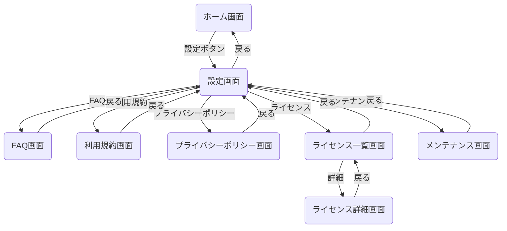
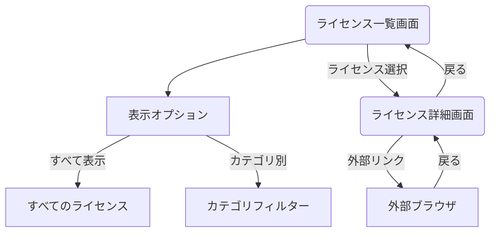
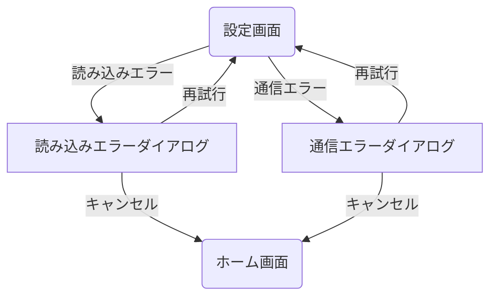

# 設定機能フロー画面遷移図

## 概要

<!--
このドキュメントでは、アプリケーションの設定画面関連の画面遷移を詳細に記載します。
設定画面からアクセスできる各種設定項目と、それらの画面遷移フローを定義します。
メインの[画面遷移図](./screen_flow.md)の一部として参照されます。
-->

このドキュメントでは、アプリケーションの設定機能に関連する画面遷移を定義します。
設定画面からFAQ、利用規約、プライバシーポリシー、ライセンス情報などの画面への遷移と、設定変更の流れを記載しています。

## 設定機能フロー詳細

### メイン設定フロー

### ライセンス情報フロー

### エラー処理フロー

## 備考

- 設定項目は利用環境やユーザー権限によって表示/非表示が切り替わります
- 各設定画面からの「戻る」操作は、直前の画面に戻ります
- ライセンス情報は外部ライブラリごとにカテゴリ分けされています
- 外部ブラウザで開くリンクは、アプリ内ブラウザではなくOSのデフォルトブラウザを使用します
