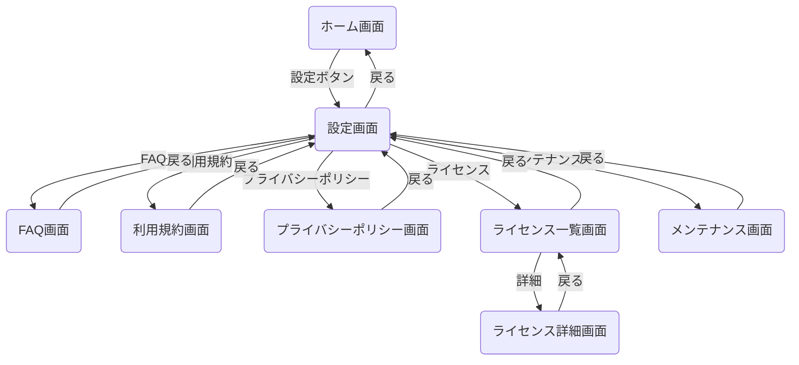
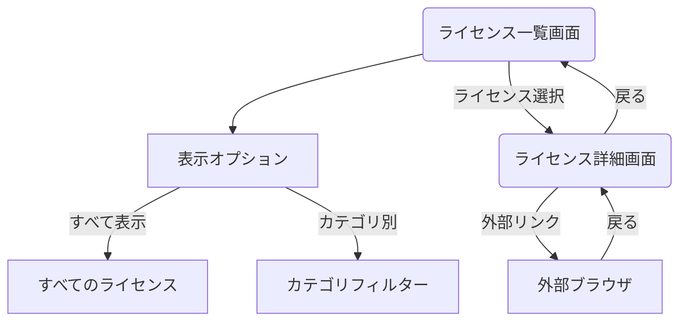
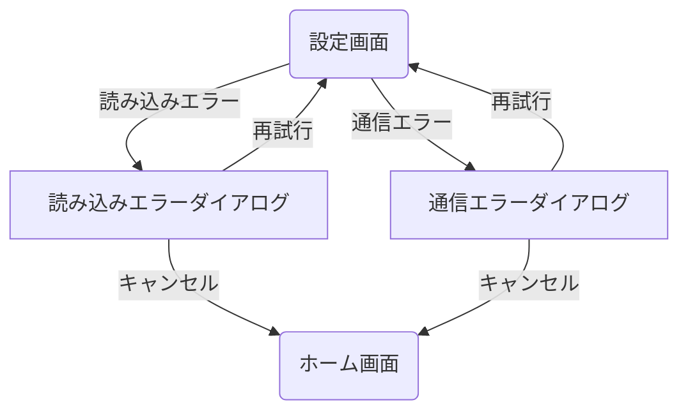

<!--
このドキュメントは機能別画面遷移図のテンプレートです。

【使い方】
- このテンプレートを基に、特定機能（ここでは設定機能）の画面遷移図を作成してください。
- 機能に関連する全ての画面とその遷移関係、条件を明確に記載してください。
- 必要に応じて図表や説明を追加し、開発者・デザイナー間での認識を統一してください。
- Mermaid記法を使用した図表の作成を推奨します。
- 機能内のサブカテゴリ（例：メイン設定フロー、ライセンス情報フローなど）ごとに整理してください。
- 同じ画面への遷移でも条件が異なる場合は、それぞれ別々に記載してください。
- 重複や表記揺れがないように注意してください。
- 画面名・遷移条件の記述は簡潔かつ明確にしてください。
- 画面名や用語は「用語集ドキュメント」、画面IDや詳細情報は「画面一覧表ドキュメント」を参照し、整合性を保ってください。
- メイン画面遷移図との整合性も確認してください。

【構成要素】
- 機能概要：この機能の目的と主な画面構成
- 詳細フロー：サブカテゴリごとの画面遷移図
- 備考：この機能特有の注意点や補足情報

【表記ルール】
- 画面IDはSCから始まる連番（例：SC001、SC002）で統一し、メイン画面遷移図と整合させてください
- 画面名は日本語（例：設定画面）を基本としてください
- 遷移条件は「"条件"」のように引用符で囲んで記載してください
- サブグラフを使用する場合は関連する画面でグループ化してください
- 全てのIDと名称は「画面一覧表ドキュメント」に準拠してください
- 用語の表記は「用語集ドキュメント」に準拠し、表記揺れを防止してください
-->

# 設定機能フロー画面遷移図

## 概要

<!--
このドキュメントでは、アプリケーションの設定画面関連の画面遷移を詳細に記載します。
設定画面からアクセスできる各種設定項目と、それらの画面遷移フローを定義します。
メインの[画面遷移図](./screen_flow.md)の一部として参照されます。
-->

このドキュメントでは、アプリケーションの設定機能に関連する画面遷移を定義します。
設定画面からFAQ、利用規約、プライバシーポリシー、ライセンス情報などの画面への遷移と、設定変更の流れを記載しています。

## 設定機能フロー詳細

<!--
設定機能フロー詳細セクションでは、設定画面を中心とした機能全体を複数のサブフローに分けて詳細に記載します。
- メイン設定フロー、ライセンス情報フロー、エラー処理フローなど、関連するフローを整理して記載してください
- 各フローは独立したMermaidチャートで表現し、関連性がある場合は説明文で補足してください
- 画面IDと画面名を一貫して使用し、遷移条件を明確に記載してください
- 複雑な条件分岐がある場合は、図中に判断ロジックを含めてください
- 設定機能に関わる全ての画面と遷移を漏れなく記載してください
-->

### メイン設定フロー

<!--
メイン設定フローでは、設定画面からアクセスできる各項目への基本的な画面遷移を記載します。
- ホーム画面から設定画面への遷移経路を記載してください
- 設定画面から各詳細画面（FAQ、利用規約など）への遷移を記載してください
- 各詳細画面からの「戻る」操作の挙動を明確にしてください
- 設定画面からホーム画面への「戻る」操作も記載してください
- メンテナンスなどの特殊状態への遷移も記載してください
-->

### ライセンス情報フロー

<!--
ライセンス情報フローでは、ライセンス一覧画面からライセンス詳細画面への遷移と操作を記載します。
- ライセンス一覧画面での表示オプションとフィルター機能を記載してください
- ライセンス選択時の詳細画面への遷移を記載してください
- 外部リンクを開く場合の挙動（外部ブラウザ起動など）を記載してください
- 「戻る」操作の挙動を明確にしてください
- ライセンス情報の表示方法に関する特殊な動作があれば記載してください
-->

### エラー処理フロー

<!--
エラー処理フローセクションでは、設定画面周辺で発生する各種エラーの処理フローを記載します。
- 読み込みエラー、通信エラーなどの処理を記載してください
- 各エラーからの回復パスとユーザーへの通知方法を記載してください
- エラー発生時の代替フローや、ホーム画面への戻り方も記載してください
- ユーザーが取れるアクションとその結果を明確にしてください
-->

## 備考

<!--
備考セクションでは、設定機能に関する補足情報や注意点を記載します。
- 設定項目の表示条件や権限による表示/非表示の切り替えを記載してください
- 「戻る」操作の挙動や特殊な動作について記載してください
- ライセンス情報の構造やカテゴリ分けに関する詳細を記載してください
- 外部リンクの取り扱いに関する詳細や注意点を記載してください
- 設定変更の保存タイミングや、変更がアプリ全体に反映されるタイミングも記載してください
-->

- 設定項目は利用環境やユーザー権限によって表示/非表示が切り替わります
- 各設定画面からの「戻る」操作は、直前の画面に戻ります
- ライセンス情報は外部ライブラリごとにカテゴリ分けされています
- 外部ブラウザで開くリンクは、アプリ内ブラウザではなくOSのデフォルトブラウザを使用します
