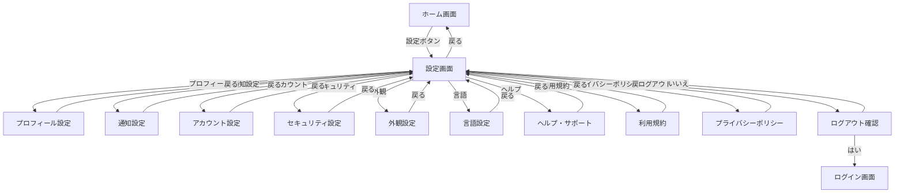
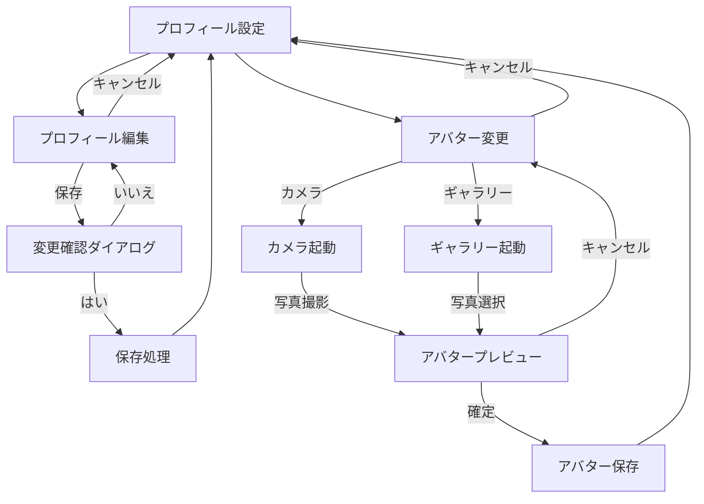
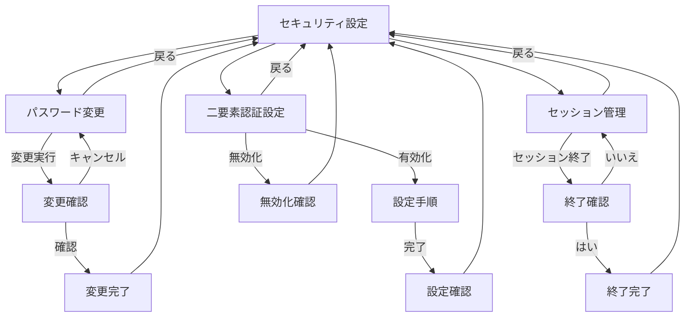
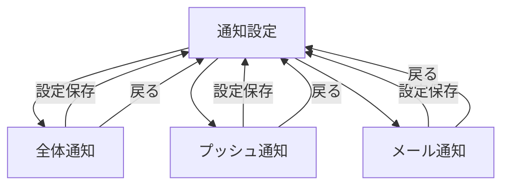

# 設定機能フロー画面遷移図

## 概要

<!--
このドキュメントでは、アプリケーションの設定画面関連の画面遷移を詳細に記載します。
設定画面からアクセスできる各種設定項目と、それらの画面遷移フローを定義します。
メインの[画面遷移図](./screen_flow.md)の一部として参照されます。
-->

このドキュメントでは、アプリケーションの設定機能に関連する画面遷移を定義します。
ユーザー設定画面から各種設定項目画面への遷移と、設定変更の流れを記載しています。

## 設定機能フロー詳細

### メイン設定フロー

### プロフィール設定フロー

### セキュリティ設定フロー

### 通知設定フロー

## 備考

- ログアウト操作は確認ダイアログで二度確認します
- セッション管理では現在のセッション以外のログインセッションを管理できます
- 一部の設定変更（言語、テーマなど）はアプリの再起動後に反映されます
- 設定項目はアプリのバージョンによって異なる場合があります
