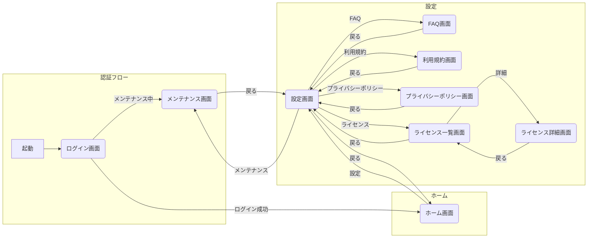

<!--
このドキュメントは画面一覧表のテンプレートです。

【使い方】
- セクションは[画面詳細]と[画面遷移図]の2項目です
- 記述はMarkdown記法とMermaid形式を使用してください
- サンプルを参考に、必要な画面の項目を入力してください
- 用語の追加・修正時は、重複や表記揺れに注意してください。

[画面詳細]　　
アプリないの画面を列挙し、必要な情報を記載してください。

[画面遷移図]
Mermaid記法で[画面詳細]で列挙した画面の関係性を可視化してください。
-->

# 画面一覧表

本ドキュメントは、画面一覧・画面構成図をまとめたものです。
画面ID・カテゴリ・日本語名・英語名・実装種別・遷移種別を整理し、ユーザーの種別ごとの画面遷移についても記載します。

<!--
このセクションでは、アプリケーション内で表示される画面一覧を表形式で記載します。
各画面について、以下の7項目の情報を管理します：

- 画面ID: 画面を一意に識別するためのID
- 画面名: 画面の日本語名称
- 画面名(英語): 画面の英語名称（コード内での命名に使用）
- 画面グループ: 機能や目的による画面の分類
- 遷移先(遷移種別): 画面間の遷移関係と遷移の種類
- 概要: 画面の主な目的や機能
- 備考: 画面の詳細な仕様や注意事項
-->

## 画面詳細

| 画面ID | 画面名                  | 画面名(英語)           | 画面グループ    | 遷移先(遷移種別)                                | 概要                | 備考 |
|:-------|:----------------------|:----------------------|:---------------|:-----------------------------------------------|:-------------------|:-----|
| SC001  | ログイン画面            | LoginPage            | 認証           | SC002(ログイン成功), SC009(メンテナンス中)      | 認証情報入力       | メールアドレスとパスワードによる認証 |
| SC002  | ホーム画面              | HomePage             | ホーム         | SC003(設定)                                    | アプリのメイン画面  | ダッシュボード形式で主要機能にアクセス可能 |
| SC003  | 設定画面                | SettingPage          | 設定           | SC002(戻る), SC004(FAQ), SC005(利用規約), SC006(プライバシーポリシー), SC007(ライセンス), SC009(メンテナンス) | アプリ設定管理      | 各種設定項目をカテゴリ別に表示 |
| SC004  | FAQ画面                | FaqPage              | 設定           | SC003(戻る)                                    | よくある質問一覧    | アコーディオン形式で質問と回答を表示 |
| SC005  | 利用規約画面            | UserAgreementPage    | 設定           | SC003(戻る)                                    | 利用規約表示        | スクロール可能なテキスト表示 |
| SC006  | プライバシーポリシー画面  | PrivacyPolicyPage    | 設定           | SC003(戻る)                                    | プライバシーポリシー表示 | スクロール可能なテキスト表示 |
| SC007  | ライセンス一覧画面       | LicensePage          | 設定           | SC003(戻る), SC008(詳細)                       | 使用ライセンス一覧  | リスト形式でライセンス情報を表示 |
| SC008  | ライセンス詳細画面       | LicenseDetailPage    | 設定           | SC007(戻る)                                    | 個別ライセンス詳細  | ライセンスの詳細情報を表示 |
| SC009  | メンテナンス画面         | MaintenancePage      | メンテナンス    | SC003(戻る)                                    | システムメンテナンス中表示 | メンテナンス中の表示と予定終了時刻を表示 |

## 画面遷移図

<!--
このセクションでは、画面詳細で定義された画面間の遷移関係をMermaid記法を使用して視覚的に表現します。

　# 記述ルール
- 画面IDと画面名を括弧内に記載
- 遷移の種類を矢印の上に記載
- 関連する画面をサブグラフでグループ化
- 矢印の向きで画面の遷移方向を表現
- subgraphは適度な粒度で作成してください
--->

