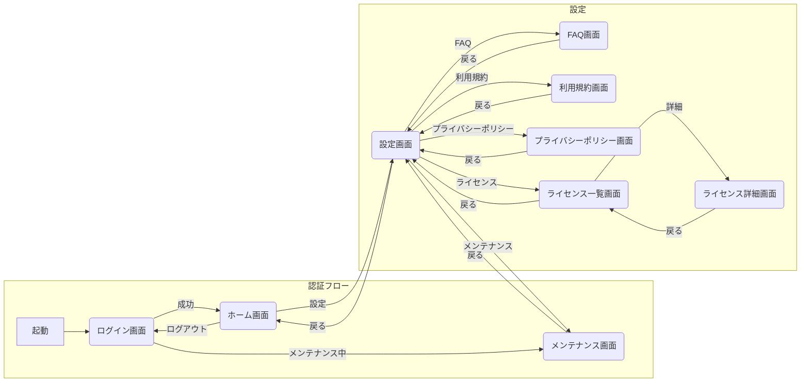

# 画面一覧表

本ドキュメントは、画面一覧・画面構成図をまとめたものです。
画面ID・カテゴリ・日本語名・英語名・実装種別・遷移種別を整理し、ユーザーの種別ごとの画面遷移についても記載します。

## 画面遷移図

## 画面詳細

| 画面ID | 画面名                  | 画面名(英語)           | 画面グループ    | 遷移先(遷移種別)                                | 備考                |
|:-------|:----------------------|:----------------------|:---------------|:-----------------------------------------------|:-------------------|
| SC001  | ログイン画面            | LoginPage            | 認証           | SC002(ログイン成功), SC009(メンテナンス中)      | 認証情報入力       |
| SC002  | ホーム画面              | HomePage             | メイン         | SC003(設定)                                    | アプリのメイン画面  |
| SC003  | 設定画面                | SettingPage          | 設定           | SC002(戻る), SC004(FAQ), SC005(利用規約), SC006(プライバシーポリシー), SC007(ライセンス), SC009(メンテナンス) | アプリ設定管理      |
| SC004  | FAQ画面                | FaqPage              | 設定           | SC003(戻る)                                    | よくある質問一覧    |
| SC005  | 利用規約画面            | UserAgreementPage    | 設定           | SC003(戻る)                                    | 利用規約表示        |
| SC006  | プライバシーポリシー画面  | PrivacyPolicyPage    | 設定           | SC003(戻る)                                    | プライバシーポリシー表示 |
| SC007  | ライセンス一覧画面       | LicensePage          | 設定           | SC003(戻る), SC008(詳細)                       | 使用ライセンス一覧  |
| SC008  | ライセンス詳細画面       | LicenseDetailPage    | 設定           | SC007(戻る)                                    | 個別ライセンス詳細  |
| SC009  | メンテナンス画面         | MaintenancePage      | メンテナンス    | SC003(戻る)                                    | システムメンテナンス中表示 |

**補足事項:**

- 画面遷移図は、アプリ全体の画面の流れをmermaid記法で記述します。必要に応じて、認証フロー、メイン機能、設定など、機能ごとにサブグラフで分割すると見やすくなります。
- 画面詳細テーブルには、各画面のID、名称、概要、主要なUIコンポーネント、遷移先、備考などを記載します。
- UIコンポーネントは、具体的な名称（例: TextButton, TextField, ListView）を記述すると、より詳細な仕様になります。
- 遷移先は、画面IDで記述することで、画面遷移図との対応が明確になります。
- 備考欄には、画面に関する特記事項（例: データ取得方法、表示条件、バリデーションルールなど）を記述します。
- このテンプレートはあくまで一例です。プロジェクトの規模や要件に合わせて、必要な項目を追加・修正してください。
